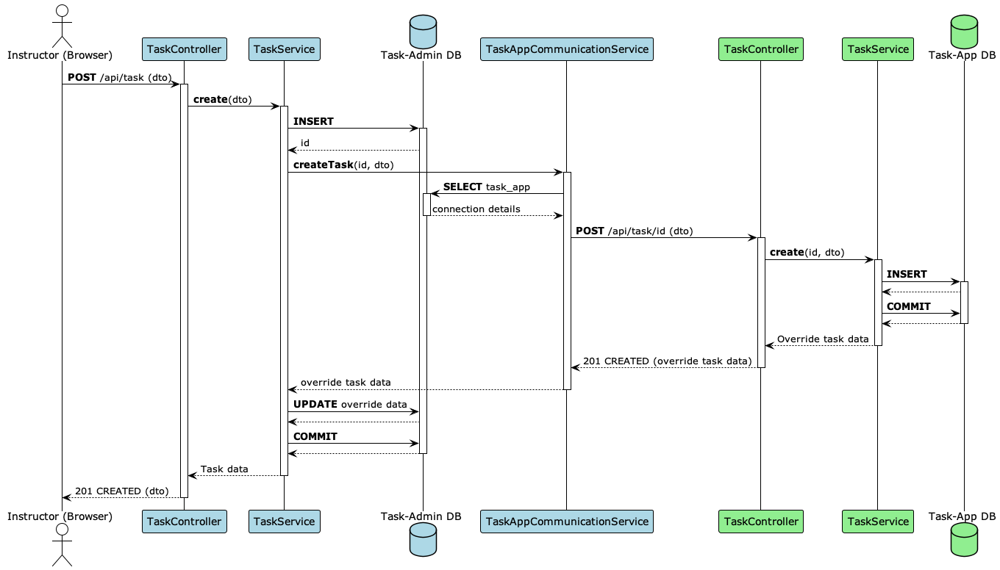

# Interaction with Task Apps

The following figure (blue ... Task Administration, green ... Task App) depicts the process of creating a task. The process for modification, deletion and the same processes for
task groups are more or less the same. When a user
creates a new task, the frontend will send a **POST**-request to the _TaskController_ of the task administration server. The controller calls the _TaskService_. The service inserts
the
general task data into the database. Then the service calls the _TaskAppCommunicationService_. This service determines the connection details for the corresponding task app by
querying the database and then sends a **POST**-request to the _TaskController_ of the task app. The controller calls the task service which stores the task type specific data into
the
database of the task app. The task app may return data to the task administration server which the server uses to override general task data (e.g. task description). This feature
can be used to automatically generate the task description or the maximum points by the task app. When the creation on the task-app succeeds the task administration server commits
the database changes and returns the general task data to the user interface. If an error occurs in the task-app, a rollback is executed.

Additional user-defined endpoints can be defined in task apps. The task administration server forwards these requests from the user interface to the according task-app. The user
interface has to send the requests to be forwarded to the `/api/forward/{taskType}/{url}` endpoint of the task administration server, where `{taskType}`
represents the task type and `{taskType}` the endpoint of the task app. For example, a request that should be sent to the `/api/task/custom` endpoint of the SQL
task-app has to be sent to the `/api/forward/sql/api/task/custom` endpoint. The task administration server will add the `X-API-KEY` header in order to authenticate the request
(only authenticated users are allowed to send such forwarded requests). If the request should be sent unauthenticated (by any user, even unauthenticated), then the request has to
be sent to the `/api/forwardPublic/{taskType}/{url}` endpoint. The task administration server will not add the `X-API-KEY` header in this case.

The task administration forwarding feature supports following HTTP methods: GET,
POST, PUT, DELETE. Following request headers are forwarded to the task-app: Accept, Accept-Language, Accept-Encoding, Content-Type, X-*.
Following response headers from the task-app are returned to the caller: Content-Type, Content-Language, Content-Disposition, X-*. Forwards to the default task-app
endpoints are prohibited.
