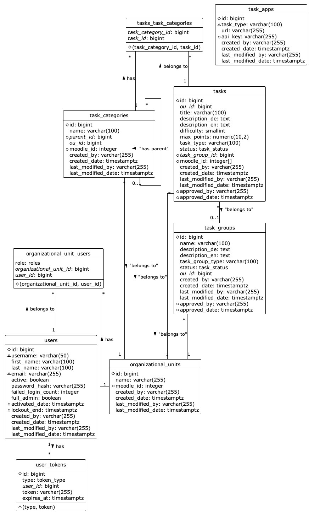

# Data Model

The application uses a PostgreSQL database for persisting application data. To access the database JPA and Spring Boot Repositories are used.
The JPA entities can be found in the `at.jku.dke.etutor.task_administration.data.entities` package, the repositories in the
`at.jku.dke.etutor.task_administration.data.repositories` package. Connection details are configured in the application configuration files
(`application*.yml`) or via environment variables. Database migrations are made with _Flyway_. The migration scripts can be found in the
`src/main/resources/db/migration` directory. The file names of the migrations have to follow the Flyway naming convention, and they
**must not** be modified. For changing the data model add a new migration.

The following figure (◇ ... Primary Key, △ ... Unique, ○ ... Nullable) shows the logical database design of the task-administration database.
Users can be assigned to multiple organizational units. An organizational unit can be for example a department or a course. For each assigned 
organizational unit a user has an assigned role. Tasks describe a specific task. The task administration server only stores the general task data. 
The specific task-data is managed by the task-apps. Depending on the task type, a task may belong to a task group. Task groups contain data that 
is used by several tasks. As with the tasks, the specific data is also managed by the task-apps. Tasks may belong to multiple task categories. Task 
categories are organised hierarchically. Tasks, task groups and task categories always belong to an organizational unit. The `moodle_id` columns of
tables `tasks`, `task_categories` and `organizational_units` are used for synchronisation with Moodle.

Tasks and task groups have a status. The status specifies whether a task is allowed to be used in quizzes or not. Following statuses are available:

* **DRAFT**: This is the initial status when a task (group) is created.
* **READY_FOR_APPROVAL**: The creation of the task (group) has been finished, and it is ready for approval.
* **APPROVED**: The task (group) has been approved and is ready for use in quizzes.

If an approved task belongs to a non-approved task group, the task is not available until the task-group has been approved too. If a task (group) gets 
approved the approval timestamp and the approval user get stored.

## Users and Roles

As mentioned previously, users can belong to multiple organizational units. For each assigned organizational unit a user has an assigned role. Following roles
can be assigned to a user:

* **ADMIN** - _Organizational Unit Administrator_: Administrators of an organizational unit have read/write-access to all tasks, task groups and task categories of the organizational unit. Furthermore, the administrator is able to manage the users of the organizational unit. Administrators can approve task (group)s.
* **INSTRUCTOR** - _Course Instructor_: Course instructors have read/write-access to all tasks, task groups and task categories of the organizational unit. Instructors can approve task (group)s.
* **TUTOR** - _Tutor_: Tutors can create tasks and task groups, and they can modify existing tasks and task groups as long as they are not approved. Tutors cannot approve task (group)s, they only can set the statuses DRAFT and READY_FOR_APPROVAL. Tutors can read all tasks and task categories.

When a user is first created, an email with an activation link is sent to the created user. When the user opens the link, he or she has to enter a password in
order to activate the account. If an account is not activated within one month, the account will be deleted again.

If a user has too many failed login attempts it will be locked for a specific amount of time. If there are too many failed login attempts from the same IP-address, 
requests from this IP-Address will be rejected for a specific amount of time.
